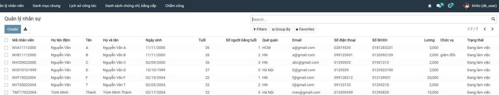
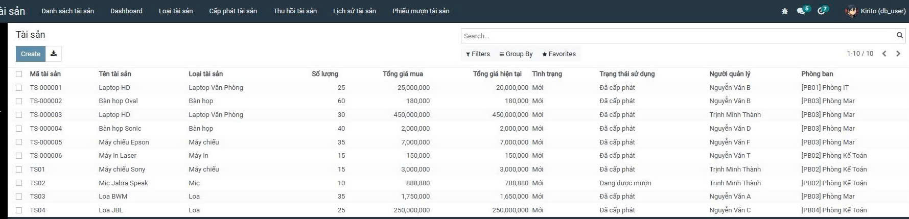

<h2 align="center">
    <a href="https://dainam.edu.vn/vi/khoa-cong-nghe-thong-tin">
    🎓 Faculty of Information Technology (DaiNam University)
    </a>
</h2>
<h2 align="center">
   XÂY DỰNG HỆ THỐNG QUẢN LÝ TÀI SẢN VÀ PHÒNG HỌP
</h2>
<div align="center">
    <p align="center">
        
        
        
    </p>

[](https://www.facebook.com/DNUAIoTLab)
[](https://dainam.edu.vn/vi/khoa-cong-nghe-thong-tin)
[](https://dainam.edu.vn)

</div>

---

## 📖 1. Giới thiệu hệ thống

Hệ thống **Quản lý Tài sản và Phòng họp** được xây dựng nhằm hỗ trợ doanh nghiệp quản lý tập trung nhân sự, tài sản và phòng họp, giúp tối ưu việc sử dụng tài nguyên và nâng cao hiệu quả quản lý nội bộ.

**Hệ thống**: đóng vai trò trung tâm lưu trữ, xử lý và liên kết dữ liệu giữa các phân hệ.
**Người dùng**: thực hiện các nghiệp vụ quản lý, theo dõi và khai thác thông tin thông qua giao diện hệ thống.

**Các chức năng chính:**
- **Nhân sự**:
    - Quản lý nhân viên, phòng ban, đơn vị, chức vụ
    - Quản lý chứng chỉ – bằng cấp
    - Theo dõi lịch sử công tác
- **Tài sản**:
    - Quản lý tài sản, loại tài sản, nhà cung cấp
    - Cấp phát, mượn, điều chuyển, thu hồi tài sản
    - Theo dõi bảo trì, khấu hao và lịch sử tài sản
- **Phòng họp**:
    - Quản lý phòng họp và tài sản phòng họp
    - Đăng ký, mượn phòng và theo dõi lịch sử sử dụng
    - AI gợi ý phòng họp phù hợp theo nhu cầu sử dụng

---
 
## 🔧 2. Công nghệ sử dụng


---

## 🚀 3. Một số hình ảnh minh họa giao diện

### Hình 1: Giao diện tổng quan hệ thống


### Hình 2: Giao diện quản lý nhân sự


### Hình 3: Giao diện quản lý tài sản


### Hình 4: Giao diện quản lý phòng họp


---

# ⚙️ 4. Hướng dẫn cài đặt và sử dụng

## 4.1. Cài đặt công cụ, môi trường và các thư viện cần thiết

### 4.1.1. Clone project

Clone mã nguồn từ GitHub và chuyển vào thư mục dự án:

```bash
git clone https://github.com/mthanh04/TTDN-16-03-N5.git
cd TTDN-16-03-N5
git checkout <branch>
```
### 4.1.2. Cài đặt các thư viện hệ thống cần thiết

```bash
sudo apt-get install libxml2-dev libxslt-dev libldap2-dev libsasl2-dev \
libssl-dev python3.10-distutils python3.10-dev build-essential \
libffi-dev zlib1g-dev python3.10-venv libpq-dev
```

### 4.1.3. Khởi tạo môi trường ảo Python

- Tạo môi trường ảo:
  
  ```bash
  python3.10 -m venv venv
  ```

- Kích hoạt môi trường ảo và cài đặt các thư viện Python cần thiết:

  ```bash
  source venv/bin/activate
  pip install -r requirements.txt
  ```

## 4.2. Thiết lập cơ sở dữ liệu

```bash
docker-compose up -d
```

## 4.3. Cấu hình tham số chạy hệ thống

### 4.3.1. Khởi tạo file cấu hình odoo.conf

- Tạo file odoo.conf với nội dung sau:
  
    ```bash
    [options]
    addons_path = addons
    db_host = localhost
    db_port = 5432
    db_user = odoo
    db_password = odoo
    xmlrpc_port = 8069
    ```
## 4.4. Chạy hệ thống và cài đặt ứng dụng

- Khởi động hệ thống và truy cập trên trình duyệt:
  
  ```bash
  http://localhost:8069
  ```

---

## 👤 5. Liên hệ
**Họ tên**: Trịnh Minh Thành, Hoàng Thế Khải, Nguyễn Đức Ngọc.  
**Lớp**: CNTT 16-03.  
**Email**: thanhmeo260604@gmail.com.

© 2025 Faculty of Information Technology, DaiNam University. All rights reserved.


  


    
